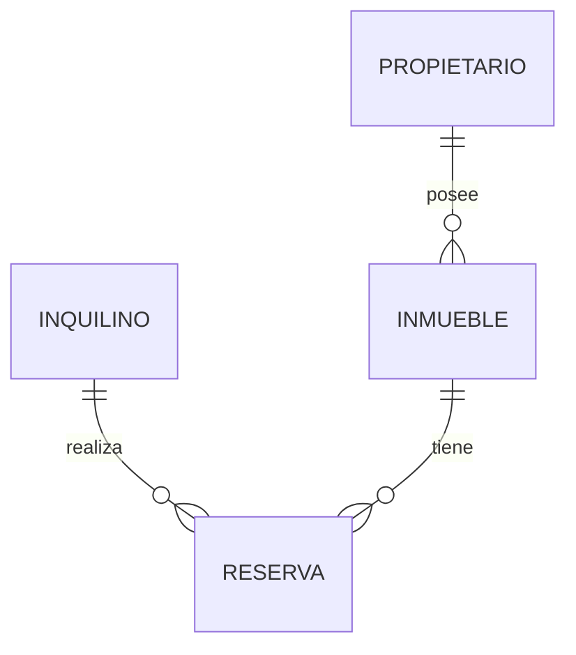

# 🏠 Inmobiliaria CC

Proyecto desarrollado para la materia **Laboratorio de Programación 2**.

El sistema tiene como objetivo informatizar la gestión de alquileres temporarios de propiedades inmuebles realizada por una agencia inmobiliaria.

---

## 👥 Integrantes del Grupo

* **Natalia Camargo** - *correo pendiente* - GitHub: *pendiente* - Discord: `pendiente`
* **Concha Guillermo** - *[gconcha@ulp.edu.ar](mailto:gconcha@ulp.edu.ar)* - GitHub: `LaloSL` - Discord: `pendiente`

---

## 📐 Modelado de Datos

A continuación se presenta el esquema del modelo de datos correspondiente a la aplicación.

### Diagrama Entidad-Relación (DER) / Diagrama de Clases

---

## 🗄️ Base de Datos

> **Pendiente:** Se incorporará el archivo `.sql` necesario para crear e inicializar la base de datos.

---

## 🚀 Instalación y ejecución

> **Pendiente:** Esta sección se completará a medida que configuremos el proyecto y la base de datos.
