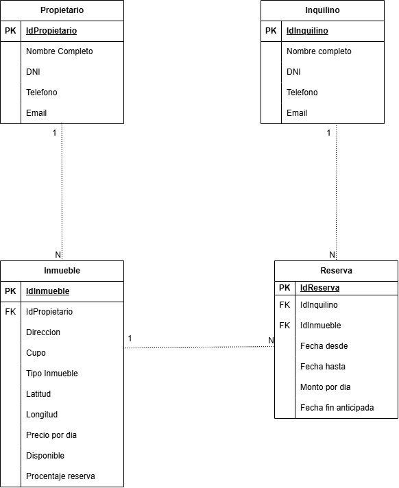

# 🏠 Inmobiliaria CC

Proyecto desarrollado para la materia **Laboratorio de Programación 2**.

El sistema tiene como objetivo informatizar la gestión de alquileres temporarios de propiedades inmuebles realizada por una agencia inmobiliaria.

---

## 👥 Integrantes del Grupo

* **Natalia Camargo** - *[camargonatalia83@gmail.com](mailto:camargonatalia83@gmail.com)* - GitHub: *pendiente* - Discord: `pendiente`
* **Concha Guillermo** - *[gconcha@ulp.edu.ar](mailto:gconcha@ulp.edu.ar)* - GitHub: `LaloSL` - Discord: `pendiente`

---

## 📐 Modelado de Datos

Se realizó un primer modelado del sistema contemplando las entidades:

* **Propietario**
* **Inmueble**
* **Inquilino**
* **Reserva**

El modelo fue diseñado de manera que pueda ampliarse posteriormente con las demás entidades y funcionalidades requeridas por el sistema.

### Relaciones definidas

* Un **Propietario** puede poseer varios **Inmuebles**.
* Cada **Inmueble** pertenece a un único **Propietario**.
* Un **Inquilino** puede realizar varias **Reservas**.
* Cada **Reserva** corresponde a un único **Inquilino**.
* Un **Inmueble** puede aparecer en distintas **Reservas** a lo largo del tiempo.
* Cada **Reserva** corresponde a un único **Inmueble**.

### Diagrama Entidad-Relación (DER)

El siguiente diagrama representa las entidades, atributos y relaciones definidas inicialmente para el sistema:



El archivo editable del diagrama se encuentra disponible en:

`docs/InmobiliariaCC.drawio`

---

## 💻 Tecnologías utilizadas

El proyecto se desarrolla utilizando:

* **ASP.NET Core MVC**
* **.NET 10**
* **C#**
* **Entity Framework Core**
* **MySQL**
* **Visual Studio Code**
* **Git / GitHub**
* **GitHub Desktop**

### Paquetes instalados

```text
MySql.EntityFrameworkCore 10.0.7
Microsoft.EntityFrameworkCore.Design 10.0.10
```

Herramienta de Entity Framework instalada:

```text
dotnet-ef 10.0.10
```

---

## 🏗️ Estado actual del desarrollo

### Completado

* Creación del repositorio GitHub.
* Configuración del archivo `.gitignore`.
* Creación y actualización del `README.md`.
* Diseño del Diagrama Entidad-Relación (DER).
* Incorporación del DER y su archivo editable en la carpeta `docs`.
* Creación del proyecto **ASP.NET Core MVC** con .NET 10.
* Comprobación de ejecución del proyecto en `localhost`.
* Instalación de `MySql.EntityFrameworkCore 10.0.7`.
* Instalación de `Microsoft.EntityFrameworkCore.Design 10.0.10`.
* Verificación de `dotnet-ef 10.0.10`.
* Inicialización de Git en la carpeta local del proyecto.
* Vinculación del repositorio local con el repositorio remoto de GitHub.
* Configuración de la rama local `main` para trabajar con `origin/main`.
* Incorporación de la estructura inicial de ASP.NET Core MVC al repositorio.
* Primer commit y push del código fuente del proyecto realizados correctamente.
* Proyecto disponible para trabajar desde Visual Studio Code y GitHub Desktop.

### Próximos pasos

1. Crear el Model `Propietario`.
2. Crear el Model `Inquilino`.
3. Crear y configurar `AppDBContext`.
4. Configurar la conexión con MySQL.
5. Crear y aplicar las migraciones.
6. Comprobar la creación de las tablas en MySQL.
7. Implementar el ABM de Propietarios.
8. Implementar el ABM de Inquilinos.

---

## 🗄️ Base de Datos

El proyecto utilizará **MySQL** como sistema gestor de base de datos y **Entity Framework Core** para realizar el acceso a datos desde ASP.NET Core.

> **Pendiente:** Configurar la conexión, crear la base de datos mediante las migraciones correspondientes e incorporar el archivo `.sql` solicitado para la entrega.

---

## 🚀 Instalación y ejecución

El proyecto puede ejecutarse desde la terminal ubicándose en la carpeta raíz del proyecto:

```bash
dotnet run
```

ASP.NET Core compilará e iniciará la aplicación e indicará en la terminal la dirección local disponible, por ejemplo:

```text
http://localhost:5104
```

Luego se puede acceder a dicha dirección desde el navegador para visualizar la aplicación.

### Requisitos actuales

Para trabajar con el proyecto es necesario disponer de:

* **.NET 10 SDK**
* **MySQL**
* **Visual Studio Code** o un entorno compatible con proyectos .NET
* **Git**
* **Entity Framework Core CLI (`dotnet-ef`)**

> La configuración de la base de datos y las instrucciones completas de instalación se ampliarán a medida que avance el desarrollo.
